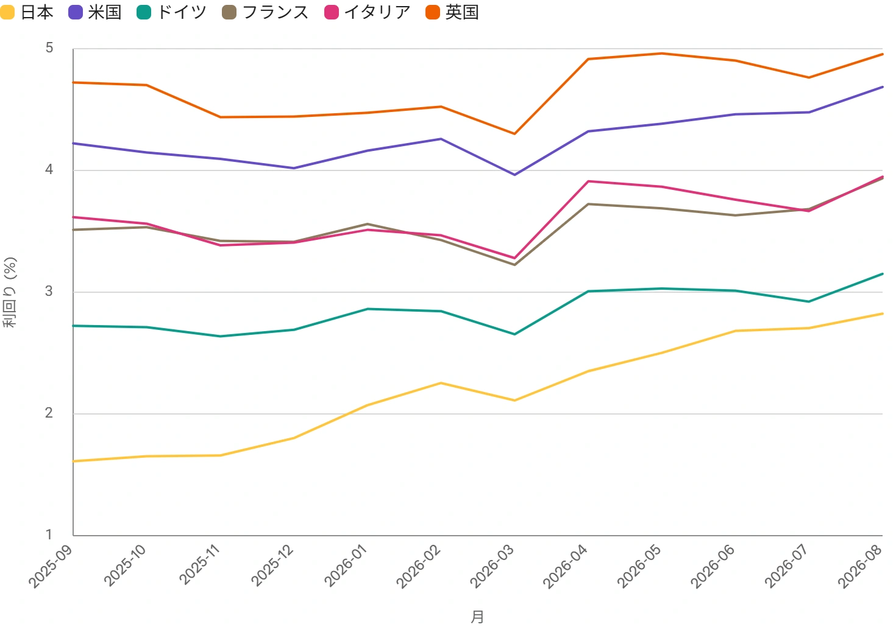

<!--
id: RX-USECASE-0040
type: use-case
language: en
locale: en
provider: QUICK Inc.
provided: 2026-09-01
status: published
translation_status: canonical
source_type: partner-provided-use-case
asset_class: Fixed Income, Macro
roles: Long-only Asset Manager, Hedge Fund Tier 1, Wealth Management / RIA
publication_mode: faithful-source-preserving
-->
# Compare 10-Year Government-Bond Yields Across Major Markets

<!-- locale-switcher:start -->
**Languages:** **English** · [日本語](../../../../ja/01-ユースケース/03-運用資産別/02-債券/global-10y-government-yields.md) · [한국어](../../../../ko/01-유스케이스/03-운용자산별/02-채권/global-10y-government-yields.md) · [简体中文](../../../../zh-cn/01-使用案例/03-按资产类别/02-固定收益/global-10y-government-yields.md) · [繁體中文（台灣）](../../../../zh-tw/01-使用案例/03-依資產類別/02-固定收益/global-10y-government-yields.md) · [繁體中文（香港）](../../../../zh-hk/01-使用案例/03-按資產類別/02-固定收益/global-10y-government-yields.md)
<!-- locale-switcher:end -->

[← Fixed income use cases](README.md) · [Browse by asset class](../README.md) · [All use cases](../../README.md)

**Provided:** 2026-09-01
**Primary assets:** Fixed Income, Macro  
**Intended users:** Long-only Asset Managers, Hedge Funds, Wealth Management / RIA

> Figures and market conditions in this example reflect the provided date.

> Analyze how long-term government-bond yields, including Japan, have changed over the past year across major countries.

## Research objective

Comparing only current 10-year yield levels tells us which country has the highest or lowest yield, but not **where the largest repricing occurred over the year, or whether the move was global or country-specific**.

The research therefore uses the same maturity and one-year window across six markets, then separates current level from one-year change. After establishing the common direction, it looks at policy, inflation, and fiscal factors to explain why the magnitude differed by country.

The sequence is: **yield level → one-year change → common drivers versus country-specific drivers**.

## Summary

Across the source period from September 1, 2025 to August 31, 2026, 10-year government-bond yields rose in all six markets. Japan had the largest increase, standing out as a catch-up move associated with monetary-policy normalization.

## One-year comparison

| Country | Around Sep. 1, 2025 | Aug. 31, 2026 | Change |
|---|---:|---:|---:|
| Japan | 1.611% | 2.941% | +1.330 pp |
| France | 3.512% | 4.174% | +0.662 pp |
| Germany | 2.724% | 3.323% | +0.599 pp |
| Italy | 3.616% | 4.163% | +0.547 pp |
| United States | 4.223% | 4.746% | +0.523 pp |
| United Kingdom | 4.723% | 5.149% | +0.426 pp |

The table deliberately separates two different questions. The UK had the highest absolute yield, while Japan experienced the largest change. Those are not the same signal.

## Country-level interpretation

After confirming that all six markets moved higher, the next step is to ask why the size of the move differed.

- **Japan:** BOJ policy normalization, expectations of further tightening, reduced bond purchases, and more persistent inflation. The source describes this as a clear exit from the ultra-low-rate regime.
- **United States:** fiscal and inflation concerns together with a higher term premium.
- **Germany:** expectations of fiscal expansion, including defense and infrastructure spending.
- **France and Italy:** yields rose alongside Germany, while spreads versus Germany were described as broadly stable rather than showing a large peripheral-risk repricing.
- **United Kingdom:** remained the highest-yielding major market in the comparison, with sticky inflation cited as an important reason.

## Conclusion

The source contrasts the high-yield US and UK markets with Japan, Germany, France, and Italy, which remained lower in absolute terms but moved upward over the year.

The standout feature was Japan: its yield level was still below the other markets, but the **speed of repricing was the largest**.

## How to read the comparison

The important distinction is between **the country with the highest yield** and **the country whose rate environment changed the most**.

A useful next step is to add each market's policy-rate outlook, inflation, fiscal stance, sovereign issuance, and relevant cross-market spreads. That helps determine whether the common rise in global yields is likely to persist or whether the opportunity has shifted toward relative-value differences across countries.

## Limitations and research basis

- The analysis uses daily sovereign yield series for September 1, 2025 through August 31, 2026.
- Yields are presented on a consistent yield-to-maturity basis.
- The source notes that qualitative confirmation from central-bank documents was limited in this particular run.
- External reference series included FRED long-term rate series for France, Italy, the UK, Japan, Germany, and the US 10-year Treasury.

## What this use case demonstrates

This workflow turns a simple cross-country yield snapshot into a comparative research process: normalize maturity and period, distinguish level from change, identify the common global move, and then isolate the policy and macro factors that explain country-level divergence.

---

This content was provided by QUICK.

Depending on country or region, language environment, product used, entitlements, and data coverage, the example may not be directly reproducible as written.

[← Fixed income use cases](README.md) · [Browse by asset class](../README.md) · [All use cases](../../README.md)
