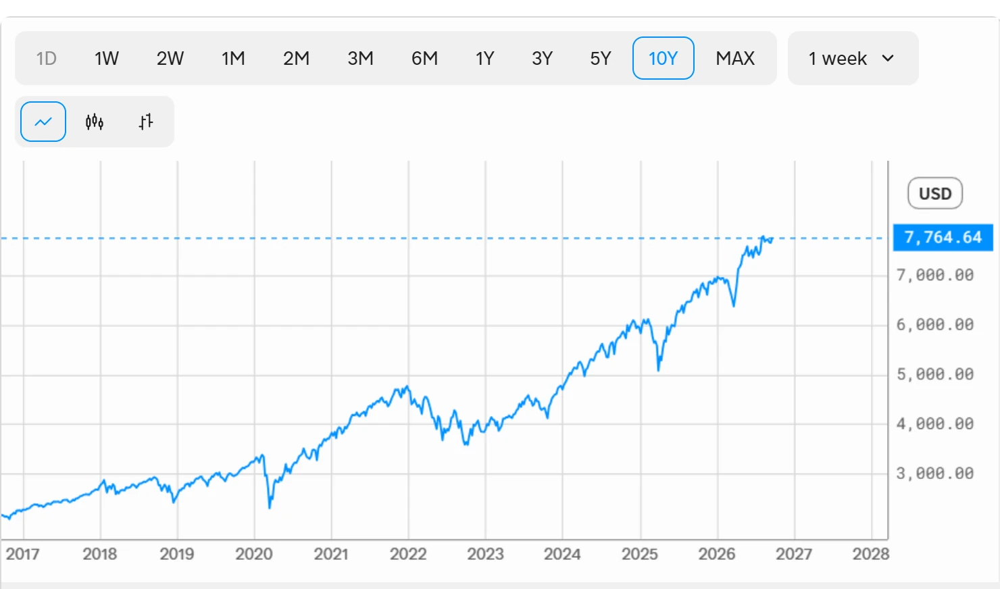

<!--
id: RX-USECASE-0066
type: use-case
language: en
locale: en
provider: QUICK Inc.
provided: 2026-09-24
status: published
translation_status: canonical
original_language: ja
source_text_status: translated_from_partner_source_reconciled_with_original
revised: 2026-09-27
editorial_reviewed: 2026-09-27
source_type: partner-provided-use-case
asset_class: Macro, Equities
publication_mode: faithful-source-preserving
-->
# Examine How the S&P 500 Moved Around US-China Summits

<!-- locale-switcher:start -->
**Languages:** **English** · [日本語](../../../../ja/01-ユースケース/03-運用資産別/03-マクロ/米中首脳会談の前後でS&P500がどう動いたか確認する.md) · [한국어](../../../../ko/01-유스케이스/03-운용자산별/03-매크로/미중-정상회담-전후-S&P-500-움직임을-살펴보기.md) · [简体中文](../../../../zh-cn/01-使用案例/03-按资产类别/03-宏观/观察美中峰会前后-S&P-500-的走势.md) · [繁體中文（台灣）](../../../../zh-tw/01-使用案例/03-依資產類別/03-總體/觀察美中峰會前後-S&P-500-的走勢.md) · [繁體中文（香港）](../../../../zh-hk/01-使用案例/03-按資產類別/03-宏觀/觀察美中峰會前後-S&P-500-的走勢.md)
<!-- locale-switcher:end -->

[← Macro use cases](README.md) · [Browse by asset class](../README.md) · [All use cases](../../README.md)

**Provided:** 2026-09-24
**Primary assets:** Macro, Equities

> Figures and market conditions in this example reflect the provided date.

> ### [Open this research example in Reflexivity →](https://app.reflexivity.com/alfred?mode=research&conversationId=299bed89-f45c-4b78-a9f9-68f7a6c63609&scrollTo=top)

## Question

**After US-China summits, did the US equity market move in response? Analyze the past 10 years.**

## Over the past decade, the content of the meeting mattered more than the meeting itself

The source concludes that US-China summits themselves rarely created a sustained trend in US equities.

The clearest market reactions came when meetings were accompanied by a **substantive change in trade policy or a temporary truce**. More ceremonial or diplomatic meetings generally produced limited reactions, while rates, inflation, and corporate earnings remained more important market drivers.

| Summit | Timing | S&P 500 before / after | Source interpretation |
| --- | --- | --- | --- |
| Trump–Xi, Mar-a-Lago | Apr. 2017 | about 2,360 → 2,345 | Little reaction |
| Trump visit to Beijing | Nov. 2017 | about 2,594 → 2,585 | Little reaction; uptrend continued |
| G20 Buenos Aires | Dec. 2018 | 2,682 → 2,700 | Small initial rise, then faded |
| G20 Osaka | Jun. 2019 | 2,913 → 2,996 | About +2.8%; clear rise |
| Biden–Xi online meeting | Nov. 2021 | about 4,682 → 4,690 | Little reaction |
| G20 Bali | Nov. 2022 | 3,993 → 3,950 | Limited reaction |
| APEC San Francisco | Nov. 2023 | 4,503 → 4,557 | Rise continued; falling-rate expectations were a larger driver |

## Separate the meetings that produced a larger reaction

**The June 2019 Osaka G20** is the strongest positive example in the source. Relief over the decision not to raise tariffs helped equities rise clearly into the following week. The source treats this as an example of markets responding when a summit contains substantive trade-policy progress.

By contrast, **the December 2018 Buenos Aires G20** produced only a temporary rebound after the truce announcement. The arrest of Huawei's CFO and concerns about Fed tightening then overlapped with the period, and the meeting agreement did not prevent the subsequent year-end selloff.

**The 2021–2023 meetings** focused more on reopening dialogue and reducing tension than on large economic deals. The source therefore views inflation and Federal Reserve policy as more important drivers of equity direction during those periods.

## What to monitor before a summit

Rather than follow only the date of the meeting, this workflow separates three questions:

1. Is there a **substantive policy change** involving tariffs, export controls, investment restrictions, or similar measures?
2. How large is that change relative to market expectations?
3. Are rates, inflation, earnings, or another market driver more important at the same time?

The historical pattern in the source is that summits with meaningful trade-policy changes can become short-term market catalysts, while diplomatic meetings without such changes tend to have limited standalone equity impact.

## Limitations

- The before/after moves are approximate and based on weekly data.
- A strict event-study test would require daily or intraday prices aligned with exact news timestamps.
- Monetary policy, inflation, earnings, and other factors were affecting equities at the same time as the summits.

---

This content was provided by QUICK.

Depending on country or region, language environment, product used, entitlements, and data coverage, the example may not be directly reproducible as written.

[← Macro use cases](README.md) · [Browse by asset class](../README.md) · [All use cases](../../README.md)
