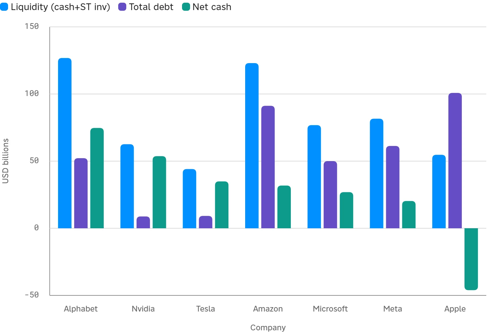

<!--
id: RX-USECASE-0064
type: use-case
language: en
locale: en
provider: QUICK Inc.
provided: 2026-09-17
status: published
translation_status: canonical
original_language: ja
source_text_status: translated_from_partner_source_reconciled_with_original
revised: 2026-09-27
editorial_reviewed: 2026-09-27
source_type: partner-provided-use-case
asset_class: Equities, Fixed Income
publication_mode: faithful-source-preserving
-->
# Compare the Magnificent Seven's Financial Capacity and Rate Resilience

<!-- locale-switcher:start -->
**Languages:** **English** · [日本語](../../../../ja/01-ユースケース/03-運用資産別/04-株式/マグニフィセント7の財務体力と金利耐性を比較する.md) · [한국어](../../../../ko/01-유스케이스/03-운용자산별/04-주식/Magnificent-Seven의-재무여력과-금리-내성을-비교하기.md) · [简体中文](../../../../zh-cn/01-使用案例/03-按资产类别/04-股票/比较-Magnificent-Seven-的财务能力与利率韧性.md) · [繁體中文（台灣）](../../../../zh-tw/01-使用案例/03-依資產類別/04-股票/比較-Magnificent-Seven-的財務實力與利率韌性.md) · [繁體中文（香港）](../../../../zh-hk/01-使用案例/03-按資產類別/04-股票/比較-Magnificent-Seven-的財務狀況與利率韌性.md)
<!-- locale-switcher:end -->

[← Equities use cases](README.md) · [Browse by asset class](../README.md) · [All use cases](../../README.md)

**Provided:** 2026-09-17
**Primary assets:** Equities, Fixed Income

> Figures and market conditions in this example reflect the provided date.

> ### [Open this research example in Reflexivity →](https://app.reflexivity.com/app/alfred?mode=research&conversationId=21bf31be-608b-4468-9697-9408b296d4dc&scrollTo=top)

## Question

**Compare the financial condition of the Magnificent Seven. Focus especially on funding and investment, and assess their resilience to changes in interest rates.**

## Where does their financial capacity differ?

Using the latest fiscal-year financial statements, the comparison looks at the Magnificent Seven across **liquidity, debt, net cash, capital expenditure, free cash flow, funding, and rate resilience**.

Even in the high-rate environment described in the source, most of the companies generated very large operating cash flows. The main distinction is between companies that can fund expanding AI and data-center investment mostly internally and those that are supplementing internal cash generation with greater bond issuance.

### Financial comparison

| Company | Liquidity ($B) | Total Debt ($B) | Net Cash ($B) | Debt/Equity | Interest Coverage | Capex/Rev | FCF ($B) | Debt Issued ($B) |
| --- | ---: | ---: | ---: | ---: | ---: | ---: | ---: | ---: |
| Alphabet | 126.8 | 52.2 | 74.7 | 0.13 | 36x | 22.7% | 73.3 | 64.6 |
| Nvidia | 62.6 | 8.8 | 53.7 | 0.06 | 64x | 2.8% | 96.7 | 0.0 |
| Tesla | 44.1 | 9.2 | 34.9 | 0.11 | 3x | 9.0% | 6.2 | 5.6 |
| Amazon | 123.0 | 91.2 | 31.8 | 0.22 | 38x | 18.4% | 7.7 | 25.0 |
| Microsoft | 76.8 | 50.0 | 26.9 | 0.11 | 706x | 34.9% | 67.0 | 0.0 |
| Meta | 81.6 | 61.3 | 20.3 | 0.28 | 87x | 34.7% | 46.1 | 29.9 |
| Apple | 54.7 | 100.8 | -46.1 | 1.37 | net income* | 3.1% | 98.8 | 4.5 |

## Four differences that matter

1. **Net-cash positions are polarized.**  
   Apple is the only company shown with net debt, while the other six are in net cash. Alphabet has the largest net-cash position at about $74.7 billion.

2. **Investment intensity differs sharply.**  
   Microsoft and Meta have capex intensity around 35% of revenue. Amazon is also investing heavily enough that free cash flow is compressed to $7.7 billion. Nvidia and Apple are much more asset-light by this measure.

3. **Funding strategies are diverging.**  
   Alphabet, Amazon, and Meta are using substantial new bond issuance to supplement AI investment, while Nvidia and Microsoft show little or no incremental debt issuance in the source comparison.

4. **Rate resilience is not equal.**  
   Microsoft is shown with interest coverage of 706x and Meta with 87x. Tesla is around 3x, making it the most rate-sensitive of the seven on this measure.

## Rate-resilience grouping

- **Most resilient: Microsoft and Nvidia.**  
  Low leverage, very large net-cash positions, and high interest coverage limit the direct burden from higher rates.
- **Middle group, with more borrowing alongside investment: Alphabet, Amazon, and Meta.**  
  Bond issuance has increased as investment expands, but operating cash flow remains large and interest coverage is still healthy in the source data.
- **Relatively more vulnerable: Apple and Tesla.**  
  Apple is the only company with net debt in the table, while Tesla has lower earnings capacity and interest coverage than the rest of the group.

The comparison is therefore more useful than a simple ranking by cash balance. It puts **AI investment intensity, bond issuance, refinancing cost, and debt-service capacity in one view**.

## Limitations

- Fiscal year-ends differ across companies; this is not a perfectly synchronized point-in-time comparison.
- Apple's net interest expense is almost offset in its financial statements, so the source does not calculate a conventional interest-coverage multiple for Apple.
- Total-debt definitions can differ, including the treatment of lease obligations.
- The rate-sensitivity assessment does not fully model fixed-rate versus floating-rate debt.

A deeper follow-up could compare debt maturities, fixed-versus-floating exposure, and the latest quarterly investment guidance for each company.

---

This content was provided by QUICK.

Depending on country or region, language environment, product used, entitlements, and data coverage, the example may not be directly reproducible as written.

[← Equities use cases](README.md) · [Browse by asset class](../README.md) · [All use cases](../../README.md)
