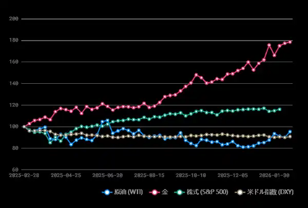
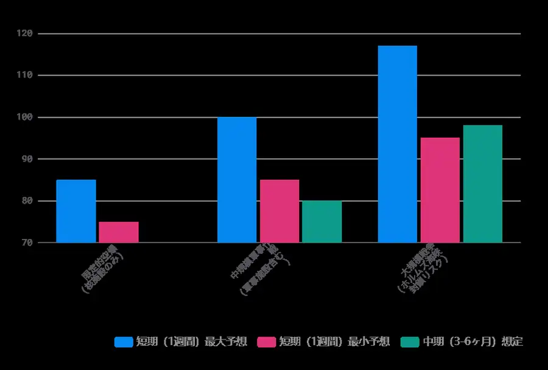
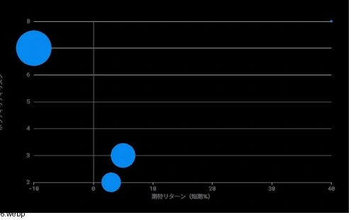

<!--
id: RX-USECASE-0059
type: use-case
language: en
locale: en
provider: QUICK Corporation
provided: 2026-03-02
status: published
translation_status: canonical
source_type: partner-provided-use-case
asset_class: commodities, equities, FX, fixed income, macro, multi-asset
publication_mode: faithful-source-preserving
prompt_status: present
-->
# Analyze the cross-asset impact of an Iran-attack scenario

<!-- locale-switcher:start -->
**Languages:** **English** · [日本語](../../../../ja/01-ユースケース/03-運用資産別/05-マルチアセット/イラン攻撃シナリオの原油・金・株式・ドルへの影響を分析する.md) · [한국어](../../../../ko/01-유스케이스/03-운용자산별/05-멀티에셋/이란-공격-시나리오의-크로스에셋-영향을-분석하기.md) · [简体中文](../../../../zh-cn/01-使用案例/03-按资产类别/05-多资产/分析伊朗遭到攻击情景下的跨资产影响.md) · [繁體中文（台灣）](../../../../zh-tw/01-使用案例/03-依資產類別/05-多資產/分析伊朗遭攻擊情境的跨資產影響.md) · [繁體中文（香港）](../../../../zh-hk/01-使用案例/03-按資產類別/05-多資產/分析伊朗受襲情景的跨資產影響.md)
<!-- locale-switcher:end -->

[← Multi-Asset use cases](README.md) · [Browse by asset class](../README.md) · [All use cases](../../README.md)

**Provided:** 2026-03-02
**Primary asset classes:** Commodities, equities, FX, fixed income, macro, multi-asset

> This is a dated, conditional scenario analysis from 2026-03-02, not a current geopolitical forecast or investment recommendation. The useful part is the research structure: establish the starting point, separate short- and medium-horizon transmission, compare with historical stress episodes, and identify the variables that would change the scenario.

## Prompt used
> [!IMPORTANT]
> If the United States and Israel attack Iran, what short- and medium-term effects could be expected for oil, gold, equities, and the US dollar?
## What the research is trying to establish

For a geopolitical shock, directional shorthand such as “oil up, stocks down” is not enough.

The research asks four more specific questions:

1. **Starting point:** how much has each asset already moved before the event?
2. **Transmission:** which channel could create the largest shock?
3. **Horizon:** which effects are likely to be immediate versus persistent over one to six months?
4. **Conditions:** what would have to happen for the scenario to intensify, persist, or reverse?

The analysis therefore follows this sequence:

**current pricing → short/medium scenarios → historical calibration → risk/return framing → variables to monitor**.

## Starting market environment

As of 2026-02-26, the QUICK-provided source used the following snapshot:

- WTI crude: **$65.21**
- Gold: **$5,176.50**
- S&P 500: **6,908.86**
- US Dollar Index: **97.74**
- VIX: **19.76**

The source's reason for establishing the starting point first was simple: the same shock can have very different incremental effects on an asset that is already extended versus one that is still relatively depressed.

## Short- and medium-horizon scenario ranges

| Asset | Source starting level | 1–7 day scenario | 1–6 month scenario |
| --- | ---: | --- | --- |
| WTI crude | $65.21 | +30% to +80% | +15% to +50% |
| Gold | $5,176.50 | +3% to +8% | +2% to +12% |
| S&P 500 | 6,908.86 | -5% to -15% | -3% to -10% |
| DXY | 97.74 | +2% to +5% | +1% to +4% |

These ranges were scenario outputs from the source material, not observed outcomes or probabilities.

## Why short term and medium term are separated

### Oil

The source treated oil as the asset with the largest potential immediate reaction because a conflict could add a sharp supply-risk premium.

For the medium horizon, the key variables were no longer the headline itself but actual supply disruption, the duration and scale of retaliation, producer response, strategic-reserve policy, and alternative supply routes.

### Gold

Gold was already sharply higher in the source snapshot, so the analysis explicitly considered the possibility that some safe-haven demand was already reflected in the price.

The medium-term case depended on conflict duration, inflation expectations, reserve demand, and whether risk appetite recovered.

### Equities

The source modeled an initial risk-off phase driven by higher energy costs, volatility, and portfolio de-risking.

It then separated sector effects, with energy and defense described as potential relative beneficiaries while airlines, transport, and consumer-sensitive areas faced more direct cost pressure.

### US dollar

The source used safe-haven demand, Treasury demand, and carry-trade unwinds as the main short-term channels.

For the medium term, it also acknowledged offsetting forces that could weaken the dollar, which is why the analysis did not treat the initial risk-off response as permanent.

## Use historical episodes for calibration, not repetition

The source compared the scenario with earlier Middle East stress episodes to judge whether its assumed ranges were plausible in magnitude.

The purpose of the comparison is **not** to claim that the current episode must repeat a historical pattern. It is to ask whether the proposed stress range is consistent with the order of magnitude seen in prior shocks.

## Risk/return framing

After setting directional scenarios, the source compared expected move and volatility rather than treating all “up” or “down” views as equivalent.

That leads to different questions by asset:

- oil: potentially large upside in the source scenario, but also extremely high volatility;
- gold: safe-haven characteristics, but starting valuation and prior gains matter;
- equities: initial downside risk versus the possibility of later normalization;
- dollar: defensive demand versus medium-term macro offsets.

## How to use the result

The point is not to select one scenario range and treat it as a forecast.

The workflow is to keep updating the variables that can change the scenario, especially:

- whether there is actual supply disruption;
- the effect on the Strait of Hormuz and other shipping routes;
- conflict duration and escalation path;
- producer and government policy response;
- whether the initial risk-off move broadens into economic or credit stress.

If those conditions change, the asset ranges should be recalibrated rather than defended.

## What this use case demonstrates

This is a scenario-analysis template for turning a geopolitical shock into a cross-asset research process while keeping the starting point, time horizon, transmission mechanism, historical calibration, and scenario-invalidating conditions explicit.

---

This content was provided by QUICK.

Depending on country or region, language environment, product used, entitlements, and data coverage, the example may not be directly reproducible as written.

[← Multi-Asset use cases](README.md) · [Browse by asset class](../README.md) · [All use cases](../../README.md)
