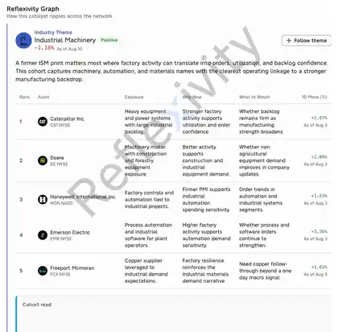

<!--
id: RX-USECASE-0008
title: "U.S. ISM Manufacturing beat lifts cyclicals (SPY)"
type: use-case
persona: "Wealth Management / RIA"
insight_type: "Market Catalyst"
signal: "Bullish"
language: en
locale: en
published: 2026-08-03
updated: 2026-10-04
status: published
source_url: "https://reflexivity.com/app/kg-insight?insightId=b7af02d1-ea54-4fa7-8915-37c6337f4488"
canonical_path: "use-cases/wealth-management-ria/u-s-ism-manufacturing-beat-lifts-cyclicals-spy.md"
translation_status: canonical
resource: "Reflexivity Insights example collection"
prompt_status: not_provided
source_manifest: RX-USECASE-0008
editorial_reviewed: 2026-10-04
-->

# U.S. ISM Manufacturing beat lifts cyclicals (SPY)

<!-- locale-switcher:start -->
**Languages:** **English** · [한국어](../../../../ko/05-유스케이스/01-운용자별/01-웰스매니지먼트RIA/미국-ISM-제조업-지표-호조로-경기민감주-상승-SPY.md) · [简体中文](../../../../zh-cn/05-使用案例/01-按投资者类型/01-财富管理RIA/美国-ISM-制造业数据超预期-周期股走强-SPY.md) · [繁體中文（台灣）](../../../../zh-tw/05-使用案例/01-依投資者類型/01-財富管理RIA/美國-ISM-製造業數據優於預期-週期股走強-SPY.md) · [繁體中文（香港）](../../../../zh-hk/05-使用案例/01-按投資者類型/01-財富管理RIA/美國-ISM-製造業數據優於預期-週期股走強-SPY.md)
<!-- locale-switcher:end -->

[← Wealth Management / RIA use cases](README.md) · [All use cases](../../README.md)
**Persona:** Wealth Management / RIA  
**Insight type:** Market Catalyst  
**Signal:** Bullish  
**Date:** August 3, 2026

> These examples are dated platform outputs. Check them against current market data before using them, or present them as illustrative examples only.

**[Open this research example in Reflexivity →](https://reflexivity.com/app/kg-insight?insightId=b7af02d1-ea54-4fa7-8915-37c6337f4488)**
## Insight view

*Dated source view showing the event summary and top takeaways.*

*Source-period Reflexivity Graph showing the related cohort and transmission paths.*

## Relevant

A firmer U.S. factory read is exactly the kind of top-down signal that drives same-day client questions an advisor has to answer.
## Compelling

The platform frames the full chain: ISM Manufacturing printed 53.3 vs 52.8 consensus with new orders at 56.7, while Prices Paid at 71.1 keeps the inflation debate alive and points to firmer yields and a stronger dollar.
## Workflow

The advisor can send a source-cited client note within minutes explaining why cyclicals can lead defensives here, and flag that duration-sensitive equity leadership may cap if rates back up.

## Resource

- **Source pack:** Reflexivity Insights example collection
- **Live Reflexivity insight:** [Open this insight in Reflexivity](https://reflexivity.com/app/kg-insight?insightId=b7af02d1-ea54-4fa7-8915-37c6337f4488)

---

[← Wealth Management / RIA use cases](README.md) · [All use cases](../../README.md)

Questions or need more information? Contact **support@reflexivity.com**.
