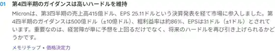

<!--
id: RX-USECASE-0071
type: use-case
language: ko
locale: ko-KR
provider: QUICK Inc.
source_created: 2026-09-30
provided: 2026-09-30
status: published
translation_status: current
source_type: partner-provided-use-case
source_manifest: RX-USECASE-0071
asset_class: Equities
insight_type: Earnings Catalyst
publication_mode: faithful-source-preserving
prompt_status: not_provided
-->
# Micron 실적을 Earnings Preview로 준비하기

<!-- locale-switcher:start -->
**Languages:** [English](../../../../en/01-use-cases/03-asset-class/04-equities/micron-earnings-preview-workflow.md) · [日本語](../../../../ja/01-ユースケース/03-運用資産別/04-株式/マイクロン決算プレビュー.md) · **한국어** · [简体中文](../../../../zh-cn/01-使用案例/03-按资产类别/04-股票/美光财报预览.md) · [繁體中文（台灣）](../../../../zh-tw/01-使用案例/03-依資產類別/04-股票/美光財報預覽.md) · [繁體中文（香港）](../../../../zh-hk/01-使用案例/03-按資產類別/04-股票/美光業績預覽.md)
<!-- locale-switcher:end -->

[← 주식 유스케이스](README.md) · [운용자산별](../README.md) · [전체 유스케이스](../../README.md)

**제공일:** 2026-09-30  
**주요 자산:** 주식

> Micron 실적 발표 전에 작성된 역사적 프리뷰 사례입니다.

QUICK 사례는 실적 발표 후 해설만 보는 것이 아니라, **발표 전에 체크포인트를 정리하는** 흐름을 보여줍니다.

> ### [Reflexivity에서 이 인사이트 열기 →](https://app.reflexivity.com/kg-insight?insightId=b6a73f02-a2ab-401e-a1c0-4e222a9f99cd)

## 사용한 프롬프트

제공 자료에서는 사용한 프롬프트의 정확한 문구를 확인할 수 없습니다.

## 발표 전

**Other → Events**에서 실적 일정을 확인하고 **Earnings Preview**를 열면 컨센서스, 핵심 지표와 주목할 포인트를 볼 수 있습니다.

제공된 화면은 **“Micron은 AI 수요에 초점을 맞춰 실적 발표에 임한다”**는 흐름으로 구성되어 있습니다. 이벤트 캘린더의 예상 EPS는 **31.5**이고, Earnings Preview 지표 패널에는 예상 매출 **$511.3억(약 $51.13B)**, 예상 EPS **$31.5**가 표시됩니다. Top 5 화면에는 Q3 매출 **$41.5B**·EPS **$25.11**, Q4 매출 가이던스 **$50B ± $1B**, 매출총이익률 약 **86%**, EPS **$31 ± $1**과 함께 공급 부족, 설비투자, HBM 수요가 언급됩니다.

## 발표 후

실적 발표가 끝나면 **Earnings Review**로 이어져, 사전에 정리한 기대치와 실제 결과를 비교합니다.

## 활용 포인트

1. **Preview:** 일정, 컨센서스, 핵심 질문을 사전에 정리합니다.
2. **Review:** 발표 후 무엇이 기대치와 달라졌는지 확인합니다.

실적 이벤트를 한 번의 뉴스 확인이 아니라 발표 전후가 연결된 리서치 프로세스로 다룰 수 있습니다.

## 제공 안내

QUICK이 2026-09-30 제공한 Reflexivity 활용 사례를 바탕으로 하며, 제공된 이메일과 화면에서 확인되는 정보만 포함했습니다.

본 콘텐츠는 QUICK에서 제공한 자료입니다.

국가·지역, 언어 환경, 이용 제품, 권한 및 데이터 제공 범위에 따라 이 예시를 그대로 재현하기 어려울 수 있습니다.

[← 주식 유스케이스](README.md) · [전체 유스케이스](../../README.md)
