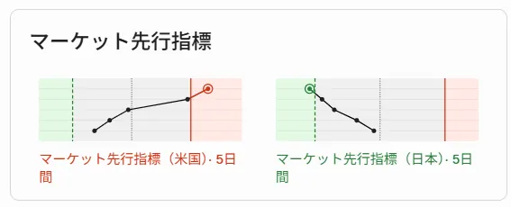
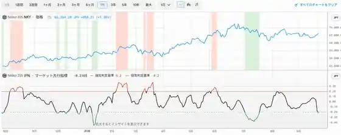

<!--
id: RX-USECASE-0068
type: use-case
language: ko
locale: ko-KR
provider: QUICK Inc.
source_created: 2026-09-28
provided: 2026-09-28
status: published
translation_status: current
source_type: partner-provided-use-case
source_manifest: RX-USECASE-0068
asset_class: Multi-Asset, Equities, Fixed Income
insight_type: Market Catalyst
publication_mode: faithful-source-preserving
prompt_status: not_provided
-->
# 시장 선행지표를 실제 시장 움직임과 비교하기

<!-- locale-switcher:start -->
**Languages:** [English](../../../../en/01-use-cases/03-asset-class/05-multi-asset/market-leading-indicator-dashboard.md) · [日本語](../../../../ja/01-ユースケース/03-運用資産別/05-マルチアセット/マーケット先行指標と実際の値動き.md) · **한국어** · [简体中文](../../../../zh-cn/01-使用案例/03-按资产类别/05-多资产/市场先行指标与实际走势.md) · [繁體中文（台灣）](../../../../zh-tw/01-使用案例/03-依資產類別/05-多資產/市場領先指標與實際走勢.md) · [繁體中文（香港）](../../../../zh-hk/01-使用案例/03-按資產類別/05-多資產/市場領先指標與實際走勢.md)
<!-- locale-switcher:end -->

[← 멀티에셋 유스케이스](README.md) · [운용자산별](../README.md) · [전체 유스케이스](../../README.md)

**제공일:** 2026-09-28  
**주요 자산:** 멀티에셋, 주식, 채권

> 화면과 시장 환경은 제공일 당시의 과거 스냅샷입니다.

QUICK 사례는 Reflexivity 대시보드 오른쪽 위의 **시장 선행지표**에서 시작합니다. 화면에서 오른쪽은 **강세**, 왼쪽은 **약세** 방향이며, 각 차트를 클릭하면 더 상세한 정보를 확인할 수 있습니다.

> 제공 자료에는 이 활용 예시를 바로 열 수 있는 Reflexivity 링크가 포함되어 있지 않습니다.

## 사용한 프롬프트

제공 자료에서는 사용한 프롬프트의 정확한 문구를 확인할 수 없습니다.

## 활용 흐름

1. 대시보드에서 시장별 방향성을 확인합니다.
2. 개별 시장 카드를 열어 종합 점수와 구성 요인을 봅니다.
3. 같은 지표의 과거 추이를 확인합니다.
4. 지표만 단독으로 보지 않고 실제 주가나 금리 움직임과 나란히 비교합니다.

제공된 화면은 미국과 일본 시장에서 주식 및 국채금리 지표를 확인하고, 종합 지표의 추이와 실제 시장 시계열을 비교하는 흐름을 보여줍니다.

## 활용 포인트

단순히 강세/약세 표시를 읽는 것이 아니라, 대시보드 신호에서 상세 요인으로 들어간 뒤 실제 시장 움직임과 대조해 선행지표를 리서치의 출발점으로 사용합니다.

## 제공 안내

이 페이지는 QUICK이 2026-09-28 제공한 Reflexivity 활용 사례를 바탕으로 작성했습니다. 제공 자료에 없는 지표 산식이나 방법론은 추정하지 않았습니다.

본 콘텐츠는 QUICK에서 제공한 자료입니다.

국가·지역, 언어 환경, 이용 제품, 권한 및 데이터 제공 범위에 따라 이 예시를 그대로 재현하기 어려울 수 있습니다.

[← 멀티에셋 유스케이스](README.md) · [전체 유스케이스](../../README.md)
