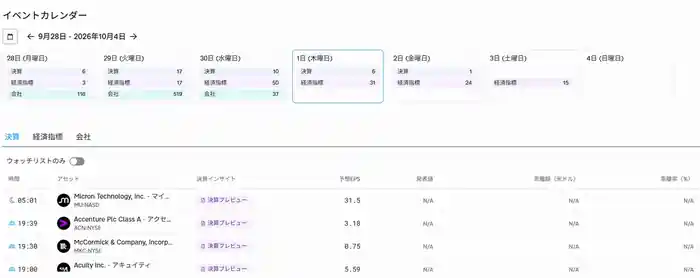

<!--
id: RX-USECASE-0071
type: use-case
language: zh
locale: zh-CN
provider: QUICK Inc.
source_created: 2026-09-30
provided: 2026-09-30
status: published
translation_status: current
source_type: partner-provided-use-case
source_manifest: RX-USECASE-0071
asset_class: Equities
insight_type: Earnings Catalyst
publication_mode: faithful-source-preserving
-->
# 用 Earnings Preview 为 Micron 财报做准备

<!-- locale-switcher:start -->
**Languages:** [English](../../../../en/01-use-cases/03-asset-class/04-equities/micron-earnings-preview-workflow.md) · [日本語](../../../../ja/01-ユースケース/03-運用資産別/04-株式/マイクロン決算プレビュー.md) · [한국어](../../../../ko/01-유스케이스/03-운용자산별/04-주식/마이크론-실적-프리뷰.md) · **简体中文** · [繁體中文（台灣）](../../../../zh-tw/01-使用案例/03-依資產類別/04-股票/美光財報預覽.md) · [繁體中文（香港）](../../../../zh-hk/01-使用案例/03-按資產類別/04-股票/美光業績預覽.md)
<!-- locale-switcher:end -->

[← 股票使用案例](README.md) · [按资产类别](../README.md) · [全部使用案例](../../README.md)

**提供日期：** 2026-09-30  
**主要资产：** 股票

> 本案例制作于 Micron 财报发布前，应作为历史性的财报前准备流程阅读。

QUICK 的案例展示了如何在财报发布前先整理检查点，而不是只在发布后查看结果。

> ### [在 Reflexivity 中打开此洞察 →](https://app.reflexivity.com/kg-insight?insightId=b6a73f02-a2ab-401e-a1c0-4e222a9f99cd)

## 发布前

从 **Other → Events** 查看财报日程，打开 **Earnings Preview** 后可以看到市场一致预期、主要指标与关注重点。

提供的画面以 **AI 需求**为 Micron 财报预览主线。事件日历显示预期 EPS **31.5**；Earnings Preview 指标面板显示预期营收 **$511.3亿（约 $51.13B）**、预期 EPS **$31.5**。Top 5 画面还提到 Q3 营收 **$41.5B**、EPS **$25.11**，Q4 营收指引 **$50B ± $1B**、毛利率约 **86%**、EPS **$31 ± $1**，以及供应紧张、资本开支与 HBM 需求。

## 发布后

财报发布后，流程转入 **Earnings Review**，把实际结果与事前预期和关注点进行比较。

## 使用价值

1. **Preview：** 先确认日程、市场预期与核心问题。
2. **Review：** 发布后检查哪些内容相对预期发生了变化。

这样可以把财报事件作为一个前后连贯的研究流程，而不是一次性的新闻查看。

## 来源

本页基于 QUICK 于 2026-09-30 提供的 Reflexivity 使用案例，仅使用邮件和截图中能够确认的信息。

本内容由 QUICK 提供。

根据国家或地区、语言环境、所用产品、权限及数据覆盖范围，可能无法完全按本文方式复现该案例。

[← 股票使用案例](README.md) · [全部使用案例](../../README.md)
