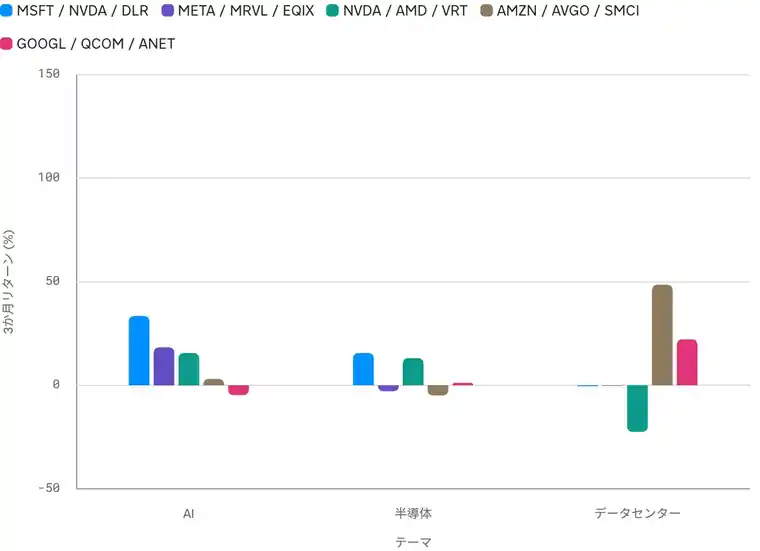
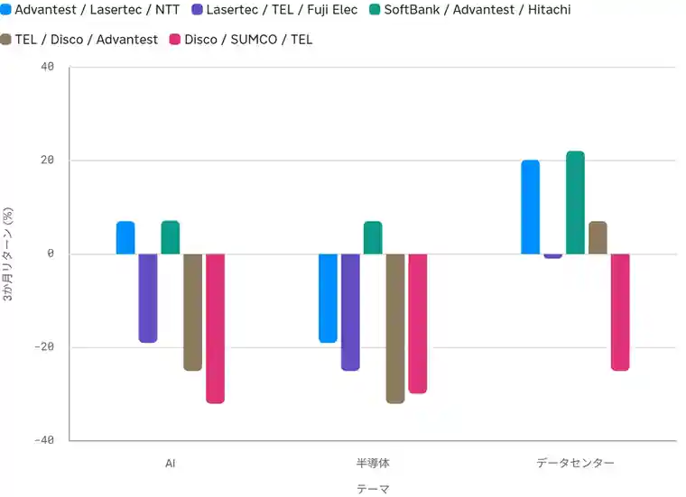

<!--
id: RX-USECASE-0072
type: use-case
language: zh
locale: zh-CN
provider: QUICK Inc.
source_created: 2026-10-01
provided: 2026-10-01
status: published
translation_status: current
source_type: partner-provided-use-case
source_manifest: RX-USECASE-0072
asset_class: Equities, Multi-Asset
insight_type: Scenario Insight
publication_mode: faithful-source-preserving
prompt_status: present
-->
# 比较美国与日本的 AI、半导体和数据中心主题

<!-- locale-switcher:start -->
**Languages:** [English](../../../../en/05-use-cases/03-asset-class/04-equities/ai-semiconductor-data-center-themes-us-japan.md) · [日本語](../../../../ja/05-ユースケース/03-運用資産別/04-株式/AI-半導体-データセンター日米比較.md) · [한국어](../../../../ko/05-유스케이스/03-운용자산별/04-주식/AI-반도체-데이터센터-미일비교.md) · **简体中文** · [繁體中文（台灣）](../../../../zh-tw/05-使用案例/03-依資產類別/04-股票/AI-半導體-資料中心美日比較.md) · [繁體中文（香港）](../../../../zh-hk/05-使用案例/03-按資產類別/04-股票/AI-半導體-數據中心美日比較.md)
<!-- locale-switcher:end -->

[← 股票使用案例](README.md) · [按资产类别](../README.md) · [全部使用案例](../../README.md)

**提供日期：** 2026-10-01  
**主要资产：** 股票、多资产  
**分析期间：** 2026-07-01 至 2026-09-30

> 收益率为原资料中的本币价格收益，不含股息。

> 比较美国和日本 AI、半导体、数据中心相关主要股票过去三个月的表现，并构建后续情景。

> ### [在 Reflexivity 中打开此研究示例 →](https://app.reflexivity.com/alfred?mode=research&conversationId=944136af-a0bf-411f-959c-8dd2368b16a8&scrollTo=top)

## 使用的提示词

> [!IMPORTANT]
> 比较过去三个月美国和日本主要AI、半导体和数据中心相关股票的表现，并构建后续可能的情景。
## 美国

| 主题 | 原资料主要示例 |
|---|---|
| AI | Microsoft +33.5%、Meta +18.3%、NVIDIA +15.6%、Amazon +3.1%、Alphabet -4.7% |
| 半导体 | NVIDIA +15.6%、AMD +13.1%、Qualcomm +1.2%、Marvell -2.9%、Broadcom -4.9% |
| 数据中心 | Super Micro +48.5%、Arista +22.2%、Equinix -0.2%、Digital Realty -0.5%、Vertiv -22.5% |

原资料显示大型 AI 股票较强，而数据中心内部明显分化。

**情景：** 乐观情景假设 hyperscaler AI 资本开支持续；基准情景继续偏向有变现和自由现金流支撑的公司；悲观情景考虑 AI 投资放缓、高利率和监管压力。

## 日本

| 主题 | 原资料主要示例 |
|---|---|
| AI | SoftBank Group +7.2%、Advantest +7.1%、Lasertec -19.0%、Tokyo Electron -25.0%、Disco -32.0% |
| 半导体 | Advantest +7.1%、Lasertec -19.0%、Tokyo Electron -25.0%、SUMCO -29.9%、Disco -32.0% |
| 数据中心 | Hitachi +22.1%、NTT +20.2%、Advantest +7.1%、Fuji Electric -1.0%、Tokyo Electron -25.0% |

日本呈现“半导体设备弱、数据中心/基础设施相对强”的结构。原资料把设备股下跌与中国相关销售下降以及亚洲 AI 股票整体调整联系起来。

**情景：** 乐观情景偏向 AI 测试/基础设施并等待设备股重估；基准情景保持基础设施优势并等待设备周期见底；悲观情景是假设中国需求走弱、AI 投资放缓，再叠加日元走强对出口股的压力。

## 比较时的限制

同样的 AI、半导体、数据中心主题，在美国与日本可能由不同价值链环节领涨。每个主题只选约 5 个主要敞口，允许重叠，并且本币收益没有做汇率调整。

## 来源

本页基于 QUICK 于 2026-10-01 提供的 Reflexivity 使用案例。

本内容由 QUICK 提供。

根据国家或地区、语言环境、所用产品、权限及数据覆盖范围，可能无法完全按本文方式复现该案例。

[← 股票使用案例](README.md) · [全部使用案例](../../README.md)
