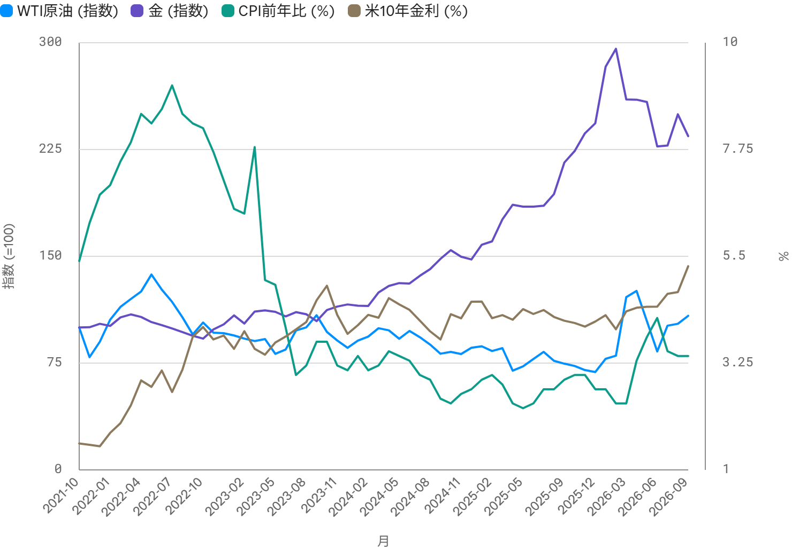
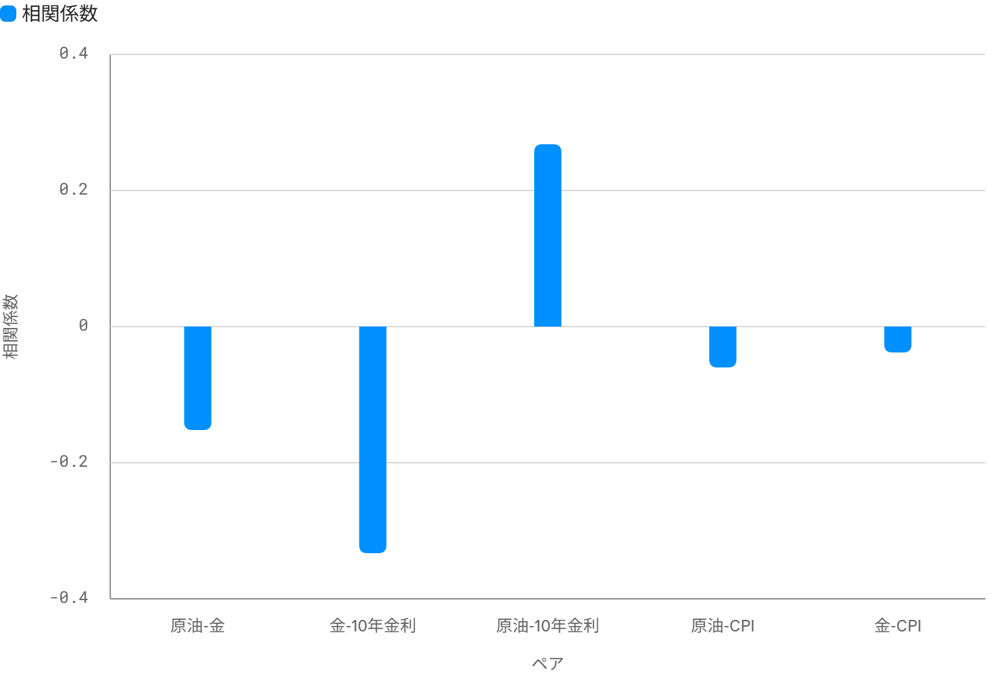

<!--
id: RX-USECASE-0073
type: use-case
language: zh-cn
locale: zh-CN
provider: QUICK Inc.
source_created: 2026-10-02
provided: 2026-10-02
status: published
translation_status: current
original_language: ja
source_text_status: faithful_translation_from_partner_source
editorial_reviewed: 2026-10-02
source_type: partner-provided-use-case
source_manifest: RX-USECASE-0073
asset_class: 多资产, 大宗商品, 宏观
insight_type: Scenario Insight
publication_mode: faithful-source-preserving
prompt_status: present
-->

# 比较原油与黄金，并结合通胀和利率构建未来情景

<!-- locale-switcher:start -->
**Languages:** [English](../../../../en/05-use-cases/03-asset-class/05-multi-asset/oil-gold-inflation-rates-scenarios.md) · [日本語](../../../../ja/05-ユースケース/03-運用資産別/05-マルチアセット/原油と金をインフレ・金利と比較しシナリオ分析する.md) · [한국어](../../../../ko/05-유스케이스/03-운용자산별/05-멀티에셋/원유와-금을-인플레이션·금리와-비교하고-시나리오-분석하기.md) · **简体中文** · [繁體中文（台灣）](../../../../zh-tw/05-使用案例/03-依資產類別/05-多資產/比較原油與黃金並結合通膨與利率建立情境.md) · [繁體中文（香港）](../../../../zh-hk/05-使用案例/03-按資產類別/05-多資產/比較原油與黃金並結合通脹及利率建立情景.md)
<!-- locale-switcher:end -->

[← 多资产使用案例](README.md) · [按资产类别浏览](../README.md) · [全部使用案例](../../README.md)

**提供日期：** 2026-10-02  
**主要资产与领域：** 大宗商品、宏观、利率、多资产

> 数值与市场环境均为提供资料当时的历史快照，不应视为当前预测。

**[在 Reflexivity 中打开此研究示例 →](https://app.reflexivity.com/alfred?mode=research&conversationId=268e57d9-2886-4e9b-bf2a-11d56bfdda32&scrollTo=top)**

## 使用的提示词

> [!IMPORTANT]
> 请比较分析原油价格与黄金价格的走势，并分析它们与通胀率（CPI）及长期利率之间的关系。在此基础上，对未来情景进行分析。

## 原油与黄金受到不同因素驱动

截至2026-10-01，WTI原油大幅反弹，而黄金现货在春季高点后回调再企稳。即使都属于大宗商品，两者的短期驱动因素也并不相同。

| 指标 | WTI原油 | 黄金现货 |
|---|---:|---:|
| 当前值 | $90.42/bbl | $4,163.97/oz |
| 3个月 | +31.85% | +0.90% |
| 6个月 | -9.69% | -10.88% |
| 1年 | +44.97% | +7.66% |
| 年初至今 | +57.47% | -3.72% |
| 52周高点 | $112.95（2026-04-07） | $5,297.87（2026-03-02） |
| 52周低点 | $55.27（2025-12-16） | $3,835.85（2025-10-02） |

同一快照中，**美国CPI同比为3.4%**，**美国10年期国债收益率为5.285%**，较一年前上升约**1.142个百分点**。

*提供资料图表（日文标注）：以100为基准标准化WTI原油与黄金，并叠加美国CPI同比和美国10年期国债收益率。*

## 过去5年月度变化的相关性

基于59个月度观测值，资料给出的相关系数如下：

| 关系 | 相关系数 |
|---|---:|
| 黄金 vs 美国10年期收益率 | -0.333 |
| 原油 vs 美国10年期收益率 | +0.268 |
| 原油 vs 黄金 | -0.152 |
| 原油 vs CPI | -0.060 |
| 黄金 vs CPI | -0.038 |

黄金与长期利率呈较明显的负相关，原油与长期利率则呈温和正相关。与CPI的同期相关性都较弱；分析同时指出，大宗商品价格可能领先于随后公布的通胀数据。

*提供资料图表（日文标注）：过去5年月度变化的相关系数。*

## 未来6至12个月的四种情景

资料引用的预测市场快照把经济过热/再通胀持续视为主要情景，其次是软着陆。以下区间是**资料中的情景示例**，不是Reflexivity生成的目标价或概率预测。

| 情景 | 宏观前提 | 原油影响 | 黄金影响 |
|---|---|---|---|
| 经济过热/再通胀持续（约68%） | CPI维持3%左右，美国10年期收益率高于5% | 需求和地缘政治溢价支撑，约$95–105 | 高实际利率压制上行，约$4,000–4,400 |
| 软着陆（约28%） | CPI回落至2%左右，美国10年期收益率降至4%左右 | 需求尚可但供应改善，中性至略弱 | 实际利率下降支撑再度上行，约$4,400–4,800 |
| 衰退/避险尾部情景 | 需求急降、降息前置、美国10年期收益率降至3%左右 | 若需求崩塌，可能跌破约$60–70 | 初期可能出现变现卖压，随后受避险需求支持 |
| 滞胀（低概率，约1%） | CPI高于4%、利率高位、增长放缓 | 若出现供应冲击，可能再次急升 | 通胀对冲需求最强 |

## 这一工作流连接了什么

分析把WTI、黄金现货、CPI、美国10年期收益率、月度变化相关性、宏观事件、新闻与情景分析连接起来。关键不在于把原油和黄金都归为“大宗商品”，而在于区分它们对增长、通胀、实际利率、地缘政治和避险需求的敏感度。

## 注意事项

- 相关性基于过去5年、59个月的月度数据，市场环境变化后可能明显改变。
- 利率和CPI使用月度差分，原油和黄金使用价格收益率；同期相关性不等于因果关系。
- 黄金使用XAU/USD现货。由于长期黄金期货序列存在换月造成的不连续，资料采用现货进行比较。
- 原油使用WTI期货（NYMEX近月）。
- 情景区间与概率均为提供日期时的假设，不是预测或投资建议。

## 提供说明

本页根据QUICK于2026-10-02提供的Reflexivity使用案例整理。

本内容由 QUICK 提供。

根据国家或地区、语言环境、所用产品、权限及数据覆盖范围，可能无法完全按本文方式复现该案例。

[← 多资产使用案例](README.md) · [全部使用案例](../../README.md)
