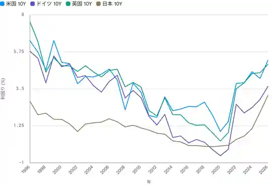
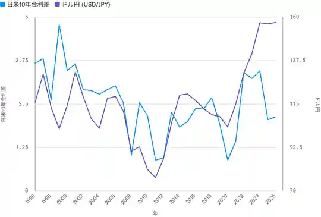
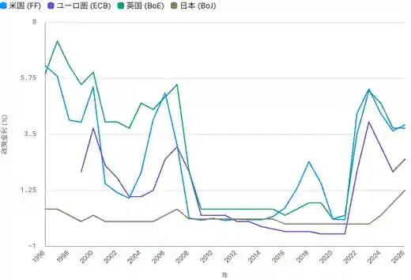

<!--
id: RX-USECASE-0070
type: use-case
language: zh
locale: zh-HK
provider: QUICK Inc.
source_created: 2026-09-30
provided: 2026-09-30
status: published
translation_status: current
source_type: partner-provided-use-case
source_manifest: RX-USECASE-0070
asset_class: Fixed Income, FX, Macro
insight_type: Scenario Insight
publication_mode: faithful-source-preserving
prompt_status: present
-->
# 用 30 年數據分析全球利率前景及 USD/JPY 影響

<!-- locale-switcher:start -->
**Languages:** [English](../../../../en/05-use-cases/03-asset-class/02-fixed-income/global-rates-outlook-and-usdjpy.md) · [日本語](../../../../ja/05-ユースケース/03-運用資産別/02-債券/金利上昇の見通しとドル円.md) · [한국어](../../../../ko/05-유스케이스/03-운용자산별/02-채권/금리상승-전망과-달러엔.md) · [简体中文](../../../../zh-cn/05-使用案例/03-按资产类别/02-固定收益/利率上升展望与美元日元.md) · [繁體中文（台灣）](../../../../zh-tw/05-使用案例/03-依資產類別/02-固定收益/利率上升展望與美元日圓.md) · **繁體中文（香港）**
<!-- locale-switcher:end -->

[← 固定收益使用案例](README.md) · [按資產類別](../README.md) · [全部使用案例](../../README.md)

**提供日期：** 2026-09-30  
**主要資產：** 固定收益、FX、宏觀

> 數字及情景均為提供日期當時的歷史分析，並非目前預測。

**[在 Reflexivity 開啟此研究例子 →](https://app.reflexivity.com/alfred?mode=research&conversationId=121c67ec-ef7a-4ad4-8526-608cf402fdd0&scrollTo=top)**

## 使用的提示詞

> [!IMPORTANT]
> 當美歐利率接近金融危機前水平時，用 30 年歷史分析未來利率路徑，並檢視日本與美歐利差及 USD/JPY 的影響。
## 把目前水平放回 30 年區間

| 來源指標 | 數值 |
|---|---:|
| 美國 10 年期國債 | 5.23% |
| 2007 年美國 10 年期高位 | 5.29% |
| 日本 10 年期國債 | 3.10% |
| 日本政策利率 | 1.25% |
| 美日 10 年利差 | +2.14 個百分點 |
| 美日 10 年利差 30 年高位 | +4.95 個百分點（2000） |
| 利差水平與 USD/JPY 的 30 年相關性 | 0.46 |
| 來源中的 USD/JPY | 157.38 |

## 來源情景

- **美國：** 可能由限制性政策轉向溫和、淺幅減息，但長期利率中樞仍可能高於 2010 年代。
- **歐元區／英國：** 通脹回落後仍有小幅寬鬆空間，但不以重回零利率為前提。
- **日本：** 若工資與物價正循環持續，漸進正常化可能延續。
- **USD/JPY：** 美日及歐日利差收窄會帶來中期日圓升值壓力，但轉折時間取決於日本央行正常化速度與美國長端利率黏性。

## 數據連結方式

把主權債孳息率、政策利率、CPI、匯率、利差計算及央行指引放在同一分析中，並區分已觀察歷史與未來情景。

## 限制

未來利率路徑及 USD/JPY 是分析情景，不是確定預測。部分 CPI 序列歷史較短，英國 10 年期資料為月頻，最新值與分析日有時差。

## 來源

本頁基於 QUICK 於 2026-09-30 提供的 Reflexivity 使用案例。

本內容由 QUICK 提供。

視乎國家或地區、語言環境、使用產品、權限及數據涵蓋範圍，未必可以完全按本文方式重現本案例。

[← 固定收益使用案例](README.md) · [全部使用案例](../../README.md)
