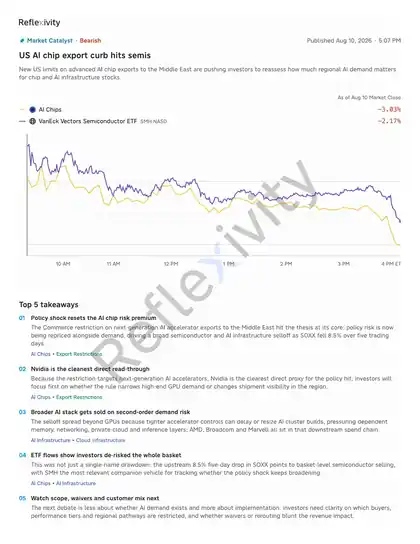
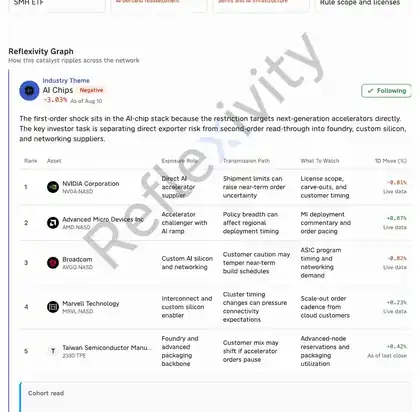

<!--
id: RX-USECASE-0020
type: use-case
persona: Tier 1 Hedge Fund
insight_type: Market Catalyst
signal: Bearish
language: zh
locale: zh-TW
published: 2026-08-10
drafted: 2026-09-07
revised:
author: Reflexivity GTM Team
service_version:
resource: Reflexivity Insights 研究案例
canonical_path: usecases/byasset/equities/us-ai-chip-export-curb-hits-semis-smh.md
status: published
translation_status: current
source_url: https://reflexivity.com/app/kg-insight?insightId=a78d51aa-a1b4-45bf-8174-a0e1e59963ca
## Insight 畫面

*當時 Insight 的政策事件、市場走勢與主要重點。*

*當時 Reflexivity Graph 中的 AI 晶片分組與傳導路徑。*

prompt_status: not_provided
source_manifest: RX-USECASE-0020
editorial_reviewed: 2026-10-04
-->

# 美國 AI 晶片出口限制衝擊半導體 (SMH)

<!-- locale-switcher:start -->
**Languages:** [English](../../../../en/05-use-cases/03-asset-class/04-equities/us-ai-chip-export-curb-hits-semis-smh.md) · [한국어](../../../../ko/05-유스케이스/03-운용자산별/04-주식/미국-AI-칩-수출-제한이-반도체에-충격-SMH.md) · [简体中文](../../../../zh-cn/05-使用案例/03-按资产类别/04-股票/美国-AI-芯片出口限制冲击半导体-SMH.md) · **繁體中文（台灣）** · [繁體中文（香港）](../../../../zh-hk/05-使用案例/03-按資產類別/04-股票/美國-AI-晶片出口限制衝擊半導體-SMH.md)
<!-- locale-switcher:end -->

[← 股票使用案例](README.md) · [依資產類別瀏覽](../README.md) · [全部使用案例](../../README.md)

**角色：** 對沖基金 
**洞察類型：** Market Catalyst 
**訊號：** 看空 
**日期：** 2026-08-10

> 本案例是特定時點的平台輸出。用於目前投資判斷前，請先與最新市場資料核對；否則僅應作為說明性案例使用。

**[在 Reflexivity 中開啟這個研究範例 →](https://reflexivity.com/app/kg-insight?insightId=a78d51aa-a1b4-45bf-8174-a0e1e59963ca)**

## 相關性

Pod PM 需要快速判斷一個政策標題究竟意味著整個半導體板塊去評級，還是單一公司事件。

## 關鍵點

Reflexivity 將其框定為重新定價 AI 晶片風險溢價的政策衝擊。美國對向中東出口先進加速器的新限制令 AI Chips 下跌 3.03%、SMH 下跌 2.17%，SOXX 五個交易日累計下跌 8.5%。

## 洞察

PM 可立即看出這不是個別公司現象，並決定在哪裡集中或避險；Nvidia 可作為下一代加速器需求最直接的映射標的。

## 資料

- **來源資料：** Reflexivity Insights 研究案例
- **Live Reflexivity insight：** [在 Reflexivity 中開啟該洞察](https://reflexivity.com/app/kg-insight?insightId=a78d51aa-a1b4-45bf-8174-a0e1e59963ca)

---

[← 股票使用案例](README.md) · [依資產類別瀏覽](../README.md) · [全部使用案例](../../README.md)

如有問題或需要更多資訊，請聯絡 **jim@reflexivity.com**。
